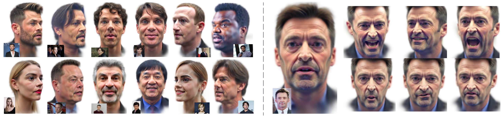

<div align="center">
  <h1>Arc2Avatar: Generating Expressive 3‑D Avatars from a Single Image via ID Guidance</h1>
</div>

<p align="center"></p>

<p align="center">
  <a href="https://dimgerogiannis.github.io/" style="color:#1a73e8;">Dimitrios Gerogiannis</a>,
  <a href="https://foivospar.github.io" style="color:#1a73e8;">Foivos Paraperas Papantoniou</a>,
  <a href="https://rolpotamias.github.io" style="color:#1a73e8;">Rolandos Alexandros Potamias</a>,
  <a href="https://alexlattas.com" style="color:#1a73e8;">Alexandros Lattas</a>,
  <a href="https://profiles.imperial.ac.uk/s.zafeiriou" style="color:#1a73e8;">Stefanos Zafeiriou</a><br>
  <span style="color:#1a73e8;">Imperial College London, UK</span>
</p>

<p align="center">
  <a href="https://arc2avatar.github.io" style="text-decoration:none;">
    
  </a>
  <a href="https://arxiv.org/abs/2501.05379" style="text-decoration:none;">
    
  </a>
</p>

---

## ✨ Introduction

**Arc2Avatar is an SDS-based method that generates a complete 3D head from a single image**, delivering:

- 🔥 **avatars of unprecedented realism, detail, and natural color fidelity**, while avoiding the common color issues of SDS.  
- 🔥 **first approach to leverage a human face foundation model** as guidance.  
- 🔥 **full 3DMM integration**, enabling expression control and refinements within the same framework.  
- 🔥 **state-of-the-art identity preservation and superior overall quality**, supported by both quantitative and qualitative results.  

---

## 🗞️ News and Updates

- ✅ **14 June 2025** – *Initial public release*: Training code and models are now available. This release reflects a small but important revision of the original paper, which addresses failure cases noted in the original version and further improves the fidelity and consistency of the generated avatars.
- 📌 **Coming soon** – Expression‑control and refinement code will be added in a follow‑up commit.
- 📌 **Coming soon** – Paper revision will be uploaded to arXiv very soon.

---

## ⚙️ Installation

### 1 · Clone CUDA submodules

```bash
cd submodules
git clone --recursive https://github.com/YixunLiang/diff-gaussian-rasterization.git
git clone --recursive https://github.com/YixunLiang/simple-knn.git
cd ..
```

### 2 · Create and activate conda environment (Python 3.9.16, CUDA 11.8, tested on NVIDIA RTX 4090)

```bash
conda create -n arc2avatar python=3.9.16 cudatoolkit=11.8
conda activate arc2avatar
```

### 3 · Install dependencies

```bash
pip install -r requirements.txt
```

### 4 · Build local CUDA extensions

```bash
pip install submodules/diff-gaussian-rasterization/
pip install submodules/simple-knn/
```

### 5 · Download required models for Arc2Face

```bash
python download_models.py
```
---

## 🚀 Usage

### 1 · Create a subject directory

Make a new folder for your subject (e.g. `subject_id`) and place a single image of the individual inside it.  
`subject_id` refers to a **path** to this subject-specific directory.

### 2 · Run the training script

```bash
python train.py --opt ./configs/config.yaml --subject subject_id --batch_size 4
```

### 3 · Track optimization progress

During training, a subfolder named `splat/` is automatically created inside `subject_id/`.  
This directory contains the evolving 3D Gaussian avatar, allowing you to visually monitor the SDS process from start to finish.

---

## 🙏 Acknowledgements

This work builds upon prior efforts. Our code is based on:

- [LucidDreamer](https://github.com/EnVision-Research/LucidDreamer)  
- [Arc2Face](https://github.com/foivospar/Arc2Face)

---

## 📚 Citation

If you find Arc2Avatar useful for your research, please consider citing our paper:

```bibtex
@InProceedings{Gerogiannis_2025_CVPR,
    author    = {Gerogiannis, Dimitrios and Papantoniou, Foivos Paraperas and Potamias, Rolandos Alexandros and Lattas, Alexandros and Zafeiriou, Stefanos},
    title     = {Arc2Avatar: Generating Expressive 3D Avatars from a Single Image via ID Guidance},
    booktitle = {Proceedings of the Computer Vision and Pattern Recognition Conference (CVPR)},
    month     = {June},
    year      = {2025},
    pages     = {10770-10782}
}
```

---
